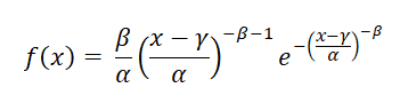
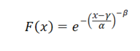
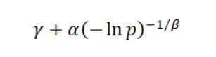

# SRIP_ML__Prerequisite-task

Task solutions will be uploaded soon.
# Question01
The probability density function  of the Frechet distribution is

for x ≥ γ. Here, γ is the location parameter, α > 0 is the shape parameter and β > 0 is the scale parameter.

The cumulative distribution function (cdf) is

The inverse cumulative distribution function is

