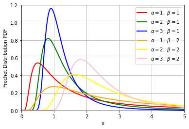

# SRIP_ML__Prerequisite-task

# Question01
The probability density function  of the Frechet distribution is

 
for x ≥ γ. Here, γ is the location parameter, α > 0 is the shape parameter and β > 0 is the scale parameter.
 
The cumulative distribution function (cdf) is

 
The inverse cumulative distribution function is

 ## kernel density estimation plot
 

 ## Frechet Distribution of different values of alpha and beta
  

